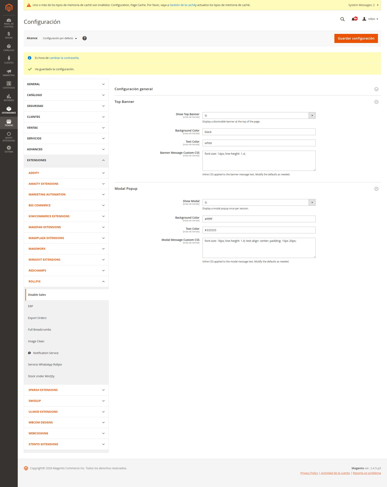

# Rollpix_DisableSales

> **[English version](README.md)**

**SPONSOR:** [www.rollpix.com](https://www.rollpix.com)

Modulo Magento 2 para deshabilitar temporalmente las ventas en una tienda online sin afectar la navegacion del catalogo. Ideal para situaciones de alta demanda, mantenimiento, o cuando se necesita pausar las compras sin bajar el sitio.

Soporta restringir las ventas por **grupo de cliente**, permitiendo bloquear compras para grupos especificos mientras otros pueden seguir comprando.

## Compatibilidad

| Requisito | Versiones soportadas |
|---|---|
| PHP | 7.4 ~ 8.3 |
| Magento | 2.4.x (Open Source / Commerce) |

## Instalacion

### Via composer (recomendado)

```bash
composer require rollpix/module-disable-sales
bin/magento module:enable Rollpix_DisableSales
bin/magento setup:upgrade
bin/magento cache:flush
```

### Manual

1. Crear la carpeta `app/code/Rollpix/DisableSales` en tu instalacion Magento.
2. Copiar todos los archivos de este repositorio dentro de esa carpeta.
3. Ejecutar:

```bash
bin/magento module:enable Rollpix_DisableSales
bin/magento setup:upgrade
bin/magento cache:flush
```

---

## Configuracion en el Admin

Ir a **Stores > Configuration > Rollpix > Disable Sales**.



La configuracion se divide en tres secciones:

### Configuracion General

| Campo | Tipo | Default | Descripcion |
|---|---|---|---|
| **Habilitar** | Si/No | No | Activa o desactiva el bloqueo de ventas |
| **Mensaje** | Textarea | _(ver abajo)_ | Mensaje que se muestra al cliente. Soporta HTML en banner y modal. En errores de checkout/carrito se muestra como texto plano |
| **Deshabilitar tambien el Checkout** | Si/No | Si | Bloquea el acceso al checkout como red de seguridad adicional |
| **Restringir a Grupos de Clientes** | Multiselect | _(vacio)_ | Seleccionar que grupos de clientes tienen la venta deshabilitada. Si esta vacio, **todos los grupos** quedan restringidos (compatible hacia atras). Incluye "NOT LOGGED IN" para usuarios no logueados |

**Mensaje por defecto:**
> Debido a la alta demanda, las compras estan temporalmente suspendidas. Podes seguir navegando el catalogo. Volve pronto!

El campo mensaje acepta **HTML**. Podes usar `<strong>`, `<br>`, `<a href="...">`, etc. El HTML se renderiza en el banner superior y en el modal. Los mensajes de error que aparecen en el checkout y carrito (via Magento message manager) se muestran como texto plano automaticamente.

#### Filtro por Grupo de Cliente

Cuando se seleccionan uno o mas grupos de clientes:

- **Solo esos grupos** tendran las ventas deshabilitadas. Los demas grupos pueden comprar normalmente.
- El frontend usa JavaScript (via `customerData` de Magento) para determinar el grupo del cliente y mostrar/ocultar botones de agregar al carrito y notificaciones dinamicamente. Esto es **totalmente compatible con Full Page Cache (FPC)**.
- Si se selecciona "NOT LOGGED IN" (grupo 0), los invitados veran los botones ocultos y el banner/modal (si estan habilitados).
- Los plugins del lado del servidor siempre aplican la restriccion independientemente del comportamiento del frontend.

Cuando **no hay grupos seleccionados** (vacio), el modulo funciona en modo legacy: las ventas se deshabilitan para todos usando CSS del lado del servidor, identico al comportamiento de v1.0.x.

### Banner Superior (Top Banner)

| Campo | Tipo | Default | Descripcion |
|---|---|---|---|
| **Mostrar Banner Superior** | Si/No | Si | Muestra un banner descartable en la parte superior de la pagina |
| **Mostrar Solo Despues de Login** | Si/No | No | Solo muestra el banner despues de que el cliente inicia sesion. Los invitados no lo veran aunque su grupo este restringido |
| **Color de Fondo** | Color | `#ff6b35` | Color de fondo del banner (formato hex) |
| **Color de Texto** | Color | `#ffffff` | Color del texto del banner (formato hex) |
| **CSS Personalizado del Banner** | Textarea | `font-size: 14px; line-height: 1.4;` | CSS inline aplicado al texto del mensaje. Viene pre-cargado con los valores por defecto para facilitar la edicion |

El banner tiene un boton de cerrar (X). Una vez cerrado, no se vuelve a mostrar en esa sesion del navegador (usa `localStorage`). El estado de cerrado se resetea automaticamente cuando el cliente inicia o cierra sesion.

### Modal Popup

| Campo | Tipo | Default | Descripcion |
|---|---|---|---|
| **Mostrar Modal** | Si/No | No | Muestra un popup modal una vez por sesion |
| **Mostrar Solo Despues de Login** | Si/No | No | Solo muestra el modal despues de que el cliente inicia sesion |
| **Color de Fondo** | Color | `#ffffff` | Color de fondo del modal |
| **Color de Texto** | Color | `#333333` | Color del texto del modal |
| **CSS Personalizado del Modal** | Textarea | `font-size: 18px; line-height: 1.6; text-align: center; padding: 10px 20px;` | CSS inline aplicado al texto del mensaje del modal. Viene pre-cargado con los valores por defecto |

El modal se muestra centrado en pantalla, con un ancho maximo de 600px. Aparece una sola vez por sesion del navegador (usa `sessionStorage`). Incluye un boton "Entendido" para cerrarlo.

**Banner y Modal pueden estar activos al mismo tiempo.** Son independientes entre si.

---

## Que hace el modulo cuando esta activo

### 1. Oculta botones "Agregar al Carrito"

**Sin filtro de grupo (modo legacy):** Se inyecta CSS inline condicional que oculta los botones `.action.tocart` y `#product-addtocart-button` en todas las paginas.

**Con filtro de grupo:** JavaScript inyecta/remueve dinamicamente un tag `<style>` basado en el grupo del cliente (determinado via `customerData`). Este enfoque es compatible con FPC.

Paginas afectadas:
- Listado de categorias
- Pagina de producto
- Resultados de busqueda
- Widgets de productos

### 2. Bloquea agregar al carrito (backend)

**Primera capa:** Plugin `around` sobre `Magento\Checkout\Controller\Cart\Add::execute`
- Verifica el grupo del cliente contra la lista de restringidos
- Si es una peticion AJAX: responde HTTP 400 JSON con el mensaje configurado
- Si es peticion normal: redirect al referer con mensaje de error en message manager

**Segunda capa:** Plugin `before` sobre `Magento\Quote\Model\Quote::addProduct`
- Verifica el grupo del cliente del quote contra la lista de restringidos
- Lanza `LocalizedException` con el mensaje (texto plano)
- Cubre cualquier punto de entrada que use el modelo Quote directamente

### 3. Bloquea el checkout (opcional)

Si "Deshabilitar tambien el Checkout" esta en Si:

- Plugin `around` sobre `Magento\Checkout\Controller\Index\Index::execute`
- Plugin `around` sobre `Magento\Checkout\Controller\Onepage\Index::execute`
- Verifica el grupo del cliente antes de bloquear
- Redirige al carrito con mensaje de error

### 4. Bloquea API REST / GraphQL

Plugin `before` sobre `Magento\Quote\Api\CartItemRepositoryInterface::save`
- Carga el quote para determinar el grupo del cliente
- Lanza `LocalizedException` bloqueando la creacion de items via API para grupos restringidos

### 5. Notificacion visual

Muestra el mensaje configurado al usuario via:
- **Banner superior**: fijo en la parte superior, descartable, personalizable en colores y CSS
- **Modal popup**: centrado en pantalla, aparece una vez por sesion, con boton "Entendido"

Ambos soportan la opcion "Mostrar Solo Despues de Login" y el filtro por grupo de cliente.

---

## Comportamiento cuando esta desactivado

Cuando **Habilitar = No**:
- No se ejecuta ninguna logica en los plugins (early return inmediato)
- No se inyecta CSS ni JS
- No se renderizan los templates de banner ni modal
- **Impacto en performance: cero**

El modulo es **100% reversible**: con solo poner Habilitar = No y limpiar cache, todo vuelve a la normalidad. No modifica tablas de base de datos, no crea crons ni observers.

---

## Arquitectura tecnica

### Estructura de archivos

```
rollpix/module-disable-sales/   (raiz del repo)
├── registration.php
├── composer.json
├── etc/
│   ├── module.xml
│   ├── di.xml                          # Plugins globales (API, Quote)
│   ├── config.xml                      # Valores por defecto
│   ├── acl.xml                         # Recurso ACL
│   ├── frontend/
│   │   └── di.xml                      # Plugins frontend (Cart, Checkout, CustomerData)
│   └── adminhtml/
│       └── system.xml                  # Configuracion del admin
├── i18n/
│   └── es_AR.csv                       # Traduccion español Argentina
├── Model/
│   ├── Config.php                      # Lectura de configuracion via ScopeConfig
│   └── Config/
│       └── Source/
│           └── CustomerGroup.php       # Source model para multiselect de grupos
├── Plugin/
│   ├── Cart/
│   │   └── AddPlugin.php              # Bloquea Cart\Add::execute
│   ├── Quote/
│   │   └── AddProductPlugin.php       # Bloquea Quote::addProduct
│   ├── Checkout/
│   │   └── DisableCheckoutPlugin.php  # Bloquea acceso al checkout
│   ├── Api/
│   │   └── CartItemRepositoryPlugin.php # Bloquea API REST/GraphQL
│   └── CustomerData/
│       └── CustomerPlugin.php          # Agrega group_id a la seccion customer
├── ViewModel/
│   └── SalesStatus.php                # Expone config al frontend
├── view/
│   └── frontend/
│       ├── layout/
│       │   └── default.xml            # Inyecta bloques en todas las paginas
│       ├── templates/
│       │   ├── banner.phtml           # Template del banner (renderizado dual)
│       │   └── modal.phtml            # Template del modal (renderizado dual)
│       └── web/
│           └── js/
│               ├── disable-sales-modal.js        # JS del modal (RequireJS)
│               └── disable-sales-group-filter.js  # JS de restriccion por grupo
└── README.md
```

### Plugins utilizados

| Plugin | Tipo | Scope | Clase interceptada |
|---|---|---|---|
| AddPlugin | around | frontend | `Magento\Checkout\Controller\Cart\Add` |
| AddProductPlugin | before | global | `Magento\Quote\Model\Quote` |
| DisableCheckoutPlugin | around | frontend | `Magento\Checkout\Controller\Index\Index` / `Onepage\Index` |
| CartItemRepositoryPlugin | before | global | `Magento\Quote\Api\CartItemRepositoryInterface` |
| CustomerPlugin | after | frontend | `Magento\Customer\CustomerData\Customer` |

### ViewModel

`Rollpix\DisableSales\ViewModel\SalesStatus` expone al frontend:
- `isDisabled()`: bool
- `getMessage()`: string
- `isBannerEnabled()` / `isModalEnabled()`: bool
- `getBannerBgColor()` / `getBannerTextColor()` / `getBannerCustomCss()`: string
- `getModalBgColor()` / `getModalTextColor()` / `getModalCustomCss()`: string
- `hasCustomerGroupFilter()`: bool
- `getRestrictedCustomerGroupsJson()`: string (JSON array de IDs de grupo)
- `isBannerShowOnLogin()` / `isModalShowOnLogin()`: bool

### ACL

Recurso: `Rollpix_DisableSales::config` bajo `Magento_Config::config`

---

## Guia de testing manual

### Funcionalidad basica

1. **Activar el modulo** en admin (Habilitar = Si) → Guardar configuracion → Limpiar cache
   - Verificar que los botones "Agregar al Carrito" desaparecen en categorias, producto, busqueda
   - Verificar que aparece el banner superior (si esta habilitado)
   - Verificar que aparece el modal (si esta habilitado)

2. **Intentar agregar al carrito via URL directa** (`/checkout/cart/add/product/ID/`)
   - Verificar que se bloquea y muestra el mensaje de error

3. **Intentar acceder al checkout** con productos en el carrito
   - Verificar que redirige al carrito con mensaje de error

4. **Desactivar el modulo** (Habilitar = No) → Limpiar cache
   - Verificar que todo vuelve a funcionar normalmente

### Filtro por grupo de cliente

5. **Seleccionar grupos especificos** (ej: "General" y "NOT LOGGED IN") → Guardar → Limpiar cache
   - Como invitado: verificar que los botones estan ocultos y aparece banner/modal
   - Loguearse como usuario del grupo "General": verificar que los botones estan ocultos
   - Loguearse como usuario de un grupo no restringido (ej: "Wholesale"): verificar que los botones son visibles y no aparece banner/modal

6. **Probar transiciones de login/logout**
   - Empezar como invitado (restringido) → loguearse como no restringido → verificar que los botones se vuelven visibles sin refrescar la pagina
   - Empezar como invitado (no restringido) → loguearse como restringido → verificar que los botones se ocultan

7. **Probar "Mostrar Solo Despues de Login"** para banner y/o modal
   - Activar la opcion → como invitado, verificar que no aparecen banner/modal
   - Loguearse como usuario restringido → verificar que aparecen banner/modal

### Personalizacion visual

8. **Cambiar mensaje, colores y CSS** → Limpiar cache
   - Verificar que los cambios se reflejan en el frontend

9. **Probar boton cerrar del banner** (X)
   - Verificar que no se muestra de nuevo al navegar (localStorage)

10. **Probar modal en modo incognito**
    - Verificar que aparece una vez y no vuelve a mostrarse en la sesion (sessionStorage)

11. **Probar banner + modal juntos**
    - Activar ambos y verificar que coexisten correctamente

---

## Desinstalacion

```bash
bin/magento module:disable Rollpix_DisableSales
bin/magento setup:upgrade
bin/magento cache:flush
```

Si se instalo via composer, ejecutar `composer remove rollpix/module-disable-sales`.
Si se instalo manualmente, eliminar la carpeta `app/code/Rollpix/DisableSales`.

No se crean ni modifican tablas de base de datos. No quedan residuos.

---

## Licencia

MIT
