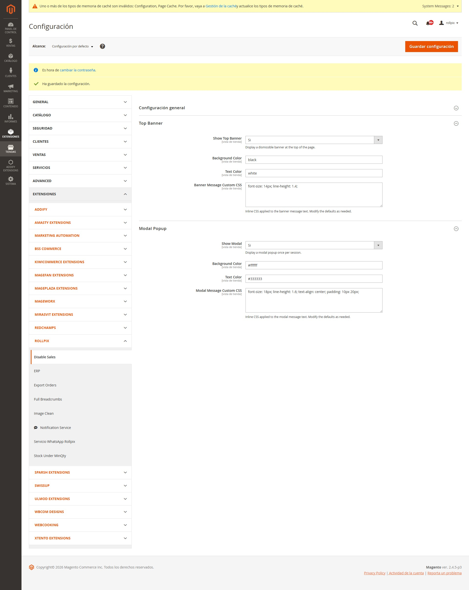

# Rollpix_DisableSales

> **[Version en español](README.es.md)**

**SPONSOR:** [www.rollpix.com](https://www.rollpix.com)

Magento 2 module to temporarily disable sales in an online store without affecting catalog navigation. Ideal for high-demand situations, maintenance, or when you need to pause purchases without taking the site down.

## Compatibility

| Requirement | Supported versions |
|---|---|
| PHP | 7.4 ~ 8.3 |
| Magento | 2.4.x (Open Source / Commerce) |

## Installation

### Via composer (recommended)

```bash
composer require rollpix/module-disable-sales
bin/magento module:enable Rollpix_DisableSales
bin/magento setup:upgrade
bin/magento cache:flush
```

### Manual

1. Create the folder `app/code/Rollpix/DisableSales` in your Magento installation.
2. Copy all files from this repository into that folder.
3. Run:

```bash
bin/magento module:enable Rollpix_DisableSales
bin/magento setup:upgrade
bin/magento cache:flush
```

---

## Admin Configuration

Go to **Stores > Configuration > Rollpix > Disable Sales**.



Configuration is divided into three sections:

### General Settings

| Field | Type | Default | Description |
|---|---|---|---|
| **Enable** | Yes/No | No | Activate or deactivate sales blocking |
| **Message** | Textarea | _(see below)_ | Message shown to customers. Supports HTML in the banner and modal. Checkout/cart error messages display as plain text |
| **Also Disable Checkout** | Yes/No | Yes | Block checkout access as an additional safety net |

**Default message:**
> Debido a la alta demanda, las compras estan temporalmente suspendidas. Podes seguir navegando el catalogo. Volve pronto!

The message field supports **HTML**. You can use `<strong>`, `<br>`, `<a href="...">`, etc. HTML renders in the top banner and modal. Error messages shown in checkout and cart (via Magento message manager) automatically display as plain text.

### Top Banner

| Field | Type | Default | Description |
|---|---|---|---|
| **Show Top Banner** | Yes/No | Yes | Display a dismissible banner at the top of the page |
| **Background Color** | Color | `#ff6b35` | Banner background color (hex format) |
| **Text Color** | Color | `#ffffff` | Banner text color (hex format) |
| **Banner Message Custom CSS** | Textarea | `font-size: 14px; line-height: 1.4;` | Inline CSS applied to the message text. Pre-loaded with defaults for easy editing |

The banner has a close button (X). Once closed, it won't show again in that browser session (uses `localStorage`). Reset by clearing localStorage or opening an incognito window.

### Modal Popup

| Field | Type | Default | Description |
|---|---|---|---|
| **Show Modal** | Yes/No | No | Display a modal popup once per session |
| **Background Color** | Color | `#ffffff` | Modal background color |
| **Text Color** | Color | `#333333` | Modal text color |
| **Modal Message Custom CSS** | Textarea | `font-size: 18px; line-height: 1.6; text-align: center; padding: 10px 20px;` | Inline CSS applied to the modal message text. Pre-loaded with defaults |

The modal is displayed centered on screen, with a max-width of 600px. It appears once per browser session (uses `sessionStorage`). Includes an "Entendido" (Got it) button to close.

**Banner and Modal can be active at the same time.** They are independent of each other.

---

## What the module does when active

### 1. Hides "Add to Cart" buttons

Conditional inline CSS hides `.action.tocart` and `#product-addtocart-button` buttons on:
- Category listing pages
- Product pages
- Search results
- Product widgets

### 2. Blocks add-to-cart (backend)

**First layer:** `around` plugin on `Magento\Checkout\Controller\Cart\Add::execute`
- AJAX requests: responds with JSON `error: true` and the configured message
- Standard requests: redirects to referer with error message in message manager

**Second layer:** `before` plugin on `Magento\Quote\Model\Quote::addProduct`
- Throws `LocalizedException` with the message (plain text)
- Covers any entry point using the Quote model directly

### 3. Blocks checkout (optional)

If "Also Disable Checkout" is set to Yes:

- `around` plugin on `Magento\Checkout\Controller\Index\Index::execute`
- `around` plugin on `Magento\Checkout\Controller\Onepage\Index::execute`
- Redirects to cart with error message

### 4. Blocks REST API / GraphQL

`before` plugin on `Magento\Quote\Api\CartItemRepositoryInterface::save`
- Throws `LocalizedException` blocking item creation via API

### 5. Visual notification

Displays the configured message to users via:
- **Top banner**: fixed at the top, dismissible, customizable colors and CSS
- **Modal popup**: centered on screen, appears once per session, with "Got it" button

---

## Behavior when disabled

When **Enable = No**:
- No plugin logic is executed (immediate early return)
- No CSS or JS is injected
- Banner and modal templates are not rendered
- **Performance impact: zero**

The module is **100% reversible**: simply set Enable = No and flush cache, everything returns to normal. No database tables are modified, no crons or observers are created.

---

## Technical architecture

### File structure

```
rollpix/module-disable-sales/   (repo root)
├── registration.php
├── composer.json
├── etc/
│   ├── module.xml
│   ├── di.xml                          # Global plugins (API, Quote)
│   ├── config.xml                      # Default values
│   ├── acl.xml                         # ACL resource
│   ├── frontend/
│   │   └── di.xml                      # Frontend plugins (Cart, Checkout)
│   └── adminhtml/
│       └── system.xml                  # Admin configuration
├── i18n/
│   └── es_AR.csv                       # Spanish (Argentina) translation
├── Model/
│   └── Config.php                      # Config reading via ScopeConfig
├── Plugin/
│   ├── Cart/
│   │   └── AddPlugin.php              # Blocks Cart\Add::execute
│   ├── Quote/
│   │   └── AddProductPlugin.php       # Blocks Quote::addProduct
│   ├── Checkout/
│   │   └── DisableCheckoutPlugin.php  # Blocks checkout access
│   └── Api/
│       └── CartItemRepositoryPlugin.php # Blocks REST API/GraphQL
├── ViewModel/
│   └── SalesStatus.php                # Exposes config to frontend
├── view/
│   └── frontend/
│       ├── layout/
│       │   └── default.xml            # Injects blocks on all pages
│       ├── templates/
│       │   ├── banner.phtml           # Top banner template
│       │   └── modal.phtml            # Modal popup template
│       └── web/
│           └── js/
│               └── disable-sales-modal.js  # Modal JS (RequireJS)
└── README.md
```

### Plugins

| Plugin | Type | Scope | Intercepted class |
|---|---|---|---|
| AddPlugin | around | frontend | `Magento\Checkout\Controller\Cart\Add` |
| AddProductPlugin | before | global | `Magento\Quote\Model\Quote` |
| DisableCheckoutPlugin | around | frontend | `Magento\Checkout\Controller\Index\Index` / `Onepage\Index` |
| CartItemRepositoryPlugin | before | global | `Magento\Quote\Api\CartItemRepositoryInterface` |

### ViewModel

`Rollpix\DisableSales\ViewModel\SalesStatus` exposes to frontend:
- `isDisabled()`: bool
- `getMessage()`: string
- `isBannerEnabled()` / `isModalEnabled()`: bool
- `getBannerBgColor()` / `getBannerTextColor()` / `getBannerCustomCss()`: string
- `getModalBgColor()` / `getModalTextColor()` / `getModalCustomCss()`: string

### ACL

Resource: `Rollpix_DisableSales::config` under `Magento_Config::config`

---

## Manual testing guide

1. **Enable the module** in admin (Enable = Yes) → Save configuration → Flush cache
   - Verify "Add to Cart" buttons disappear on category, product, and search pages
   - Verify the top banner appears (if enabled)
   - Verify the modal appears (if enabled)

2. **Try adding to cart via direct URL** (`/checkout/cart/add/product/ID/`)
   - Verify it is blocked and shows the error message

3. **Try accessing checkout** with products in cart
   - Verify it redirects to cart with error message

4. **Disable the module** (Enable = No) → Flush cache
   - Verify everything returns to normal

5. **Change message, colors and CSS** → Flush cache
   - Verify changes are reflected on the frontend

6. **Test banner close button** (X)
   - Verify it doesn't show again when navigating (localStorage)

7. **Test modal in incognito mode**
   - Verify it appears once and doesn't reappear in the session (sessionStorage)

8. **Test banner + modal together**
   - Enable both and verify they coexist correctly

---

## Uninstall

```bash
bin/magento module:disable Rollpix_DisableSales
bin/magento setup:upgrade
bin/magento cache:flush
```

If installed via composer, run `composer remove rollpix/module-disable-sales`.
If installed manually, remove the `app/code/Rollpix/DisableSales` folder.

No database tables are created or modified. No residue left behind.

---

## License

MIT
